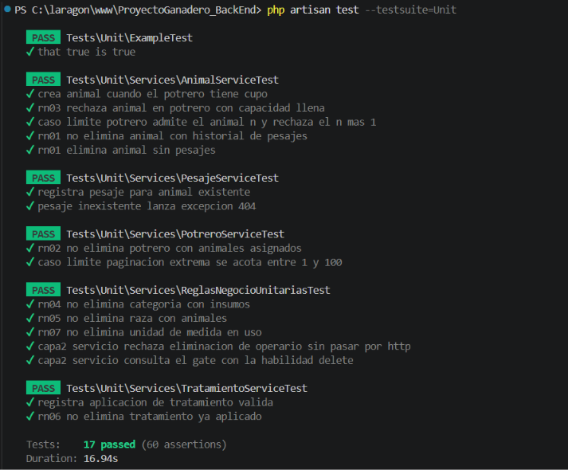
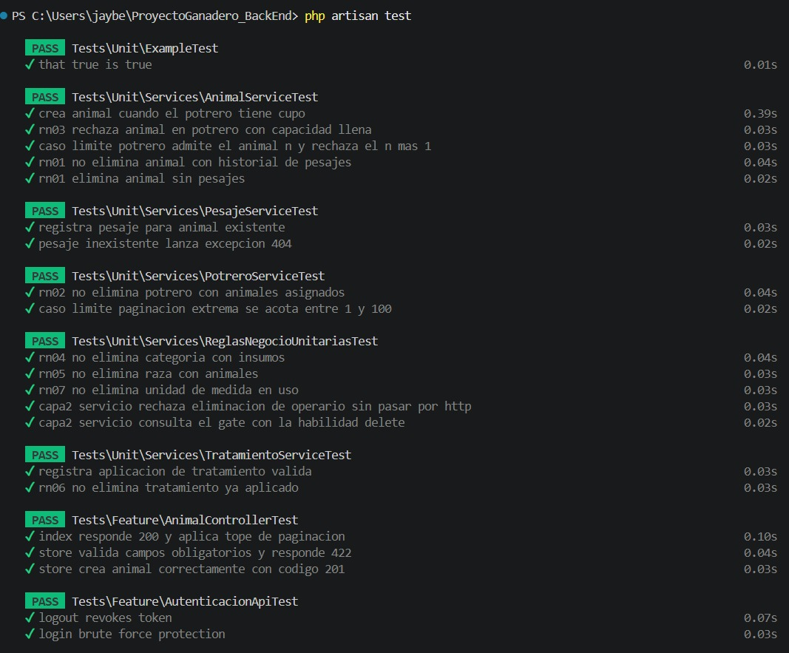
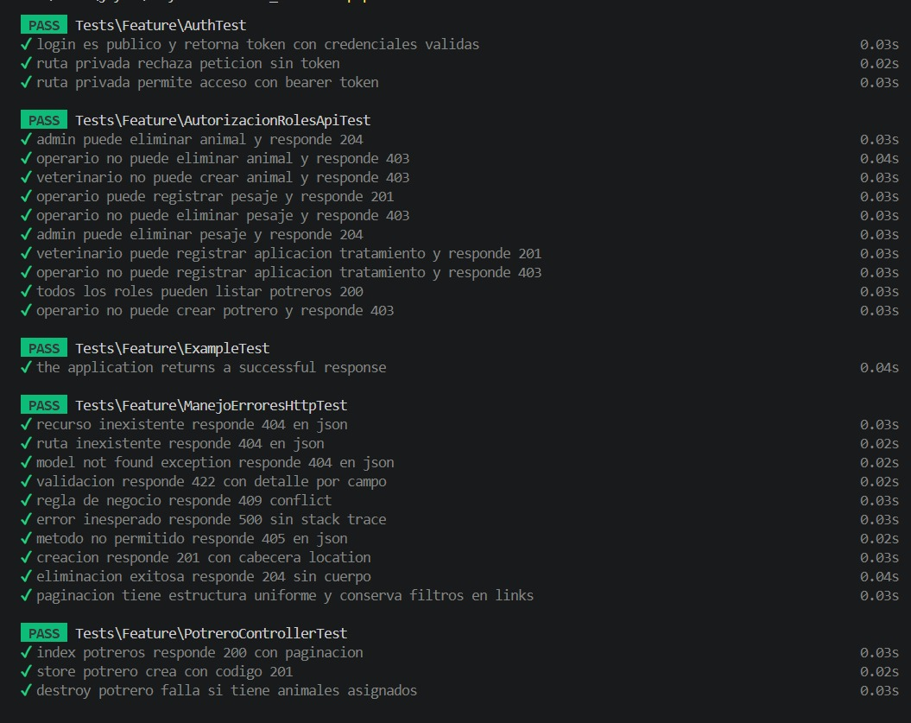
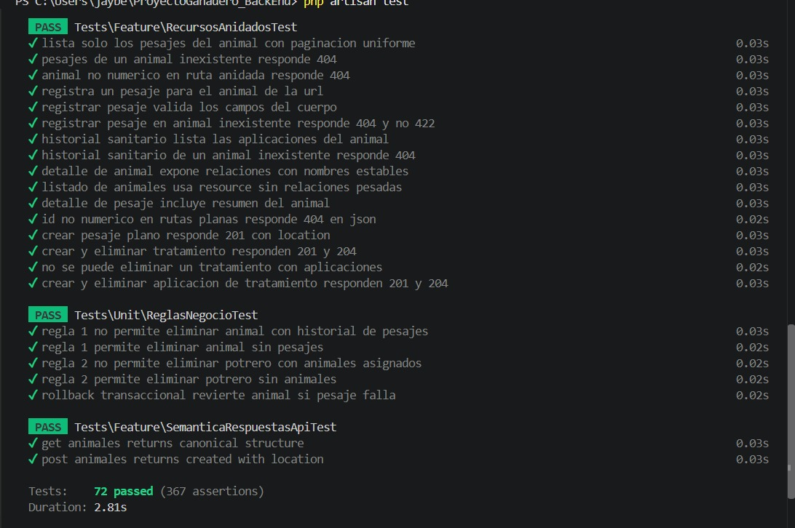
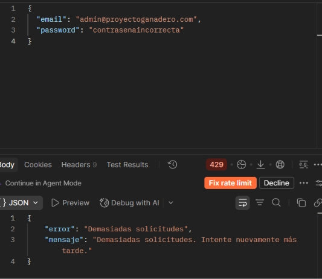
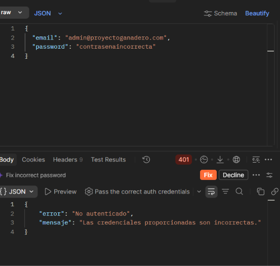
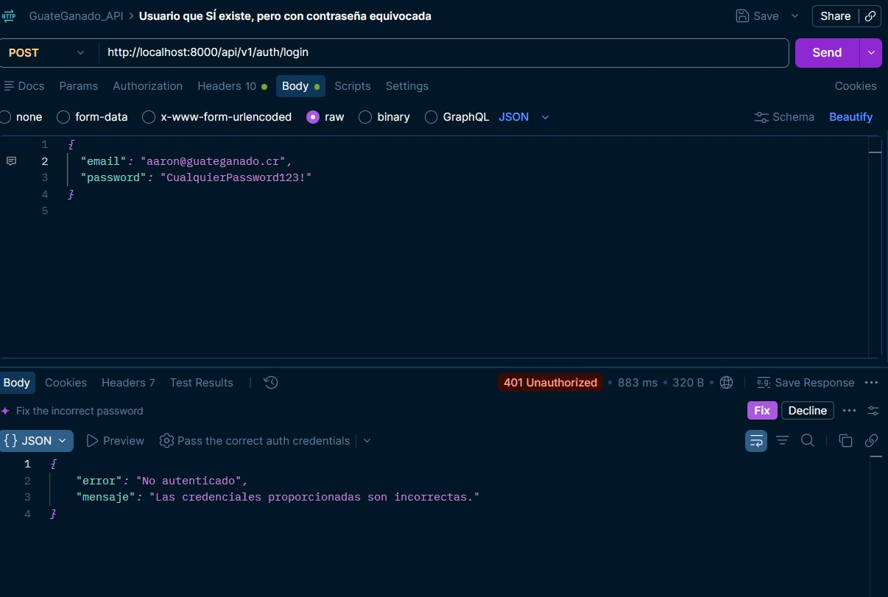
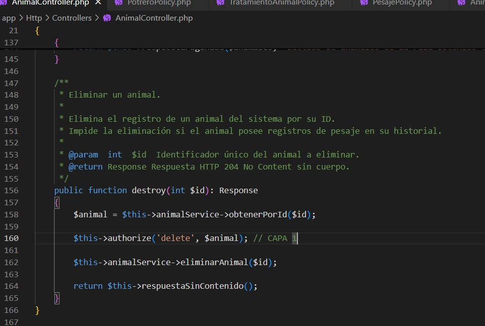

# Informe de Entrega - Laboratorio 6
**Proyecto:** ProyectoGanadero_BackEnd  
**Rol:** Persona 6 (Documentación, OpenAPI, Postman y QA Final)

---

## 1. Resumen de la Suite de Pruebas y Cobertura (18+ Tests)
Se presenta la ejecución de la suite completa de pruebas unitarias de servicio (con dobles de prueba/mocks) y pruebas de API (Feature Tests) utilizando la base de datos aislada en memoria (`:memory:`), cumpliendo con el umbral de cobertura exigido.

### A. Pruebas Unitarias de Servicio (Capa de Negocio)
Ejecución exitosa de las pruebas de servicio cubriendo el camino feliz, las reglas de negocio (RN-01 a RN-07), casos límite y la verificación de la autorización en Capa 2[cite: 1]:

>

### B. Pruebas de API y Cobertura General
Ejecución de las pruebas de funcionalidad de la API y el reporte de cobertura de código global del sistema[cite: 1]:

>
>
>
 
---

## 2. Evidencias de Seguridad y Robustez (Postman)

### A. Rate Limiting / Control de Intentos (Error 429)
Demostración de la protección contra fuerza bruta en el inicio de sesión (`POST /api/v1/auth/login`), respondiendo con `429 Too Many Requests` al superar los 5 intentos fallidos[cite: 1]:

>

### B. Revocación de Token al Cerrar Sesión (Logout)
Evidencia del funcionamiento del endpoint `POST /api/v1/auth/logout`, el cual revoca el token activo del usuario de modo que las peticiones posteriores devuelven `401 Unauthorized`[cite: 1]:

>
>

---

## 3. Demostración de Autorización en Dos Capas
Se validó la seguridad de forma estricta para evitar accesos no autorizados mediante dos niveles de defensa:
1. **Capa 1 (Rutas y Controladores):** Validación mediante políticas (*Policies*) y restricciones de middleware basadas en los roles definidos (`admin`, `veterinario`, `operario`)[cite: 1].
2. **Capa 2 (Servicios de Dominio):** Invocación directa de `Gate::authorize()` dentro de las clases de servicio, garantizando que un intento de ejecución directa sin pasar por la capa HTTP lance de inmediato una excepción de tipo `AuthorizationException` (código HTTP 403)[cite: 1].

>
>.jpeg)

** prueba de que el rol de operario no puede eliminar un animal **
>.jpeg)

---

## 4. Recursos y Enlaces del Contrato
* **Documentación OpenAPI:** Especificación técnica completa en `docs/OpenApi.yaml`[cite: 1].
* **Cliente HTTP (Postman):** Colección y entorno estandarizados con la variable global `{{base_url}}`, ubicados en `docs/GuateGanado_API.postman_collection.json` y `docs/GuateGanado_Env.postman_environment.json`[cite: 1].